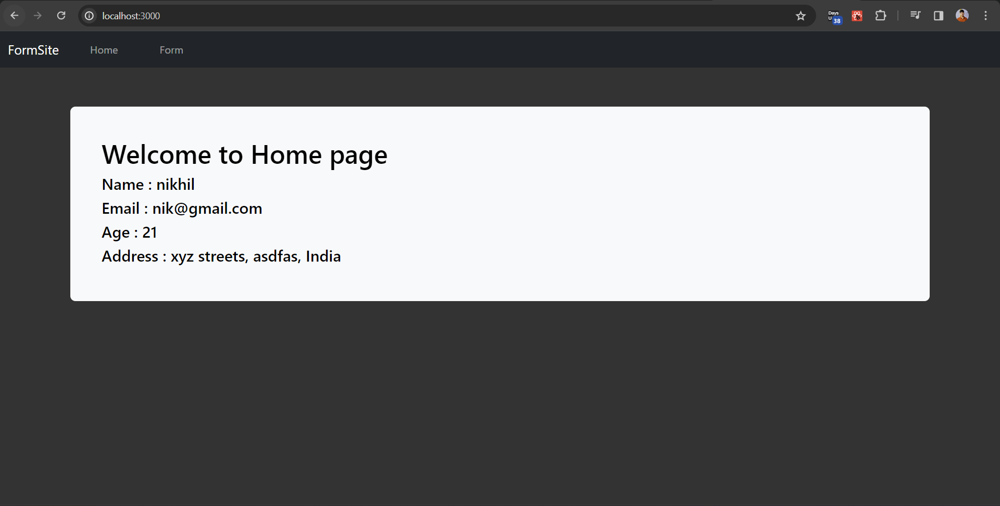
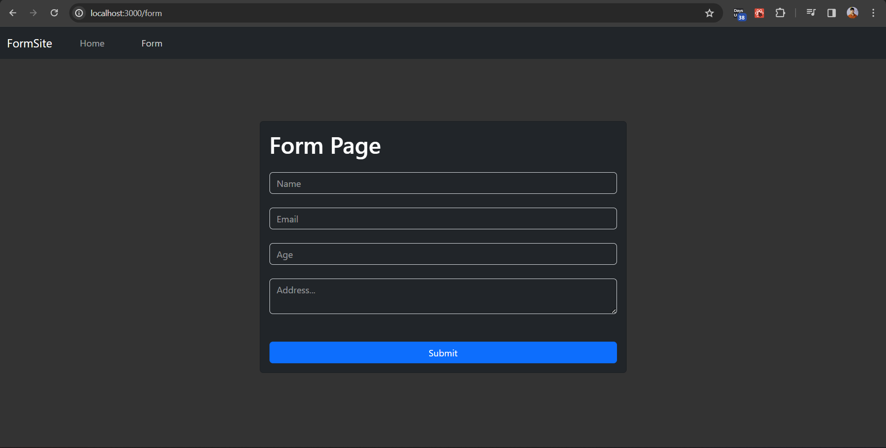
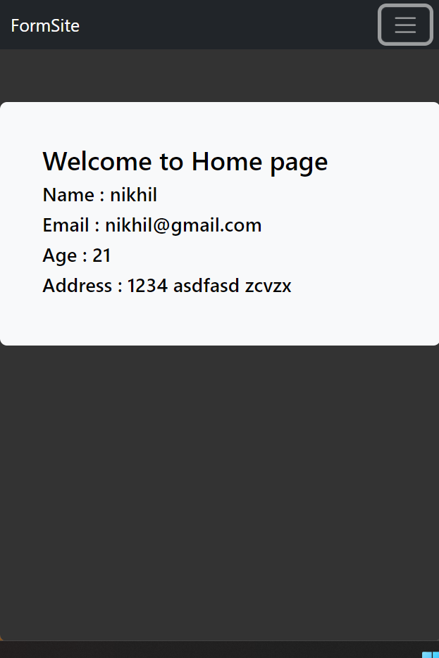

# FormSite

FormSite is a simple web application built with React.js that allows users to fill out a form with their personal information.

## Features
- Responsive.
- Users can input their name, email, age, and address into the form.
- Input fields are validated to ensure all required fields are filled out.
- Upon submission, the form data is displayed on the Home page.
- Users receive a confirmation message when the form data is successfully updated.

## Technologies Used

- React.js
- React Router (for navigation)
- Bootstrap (for styling)

## Code Structure

## Screenshots

